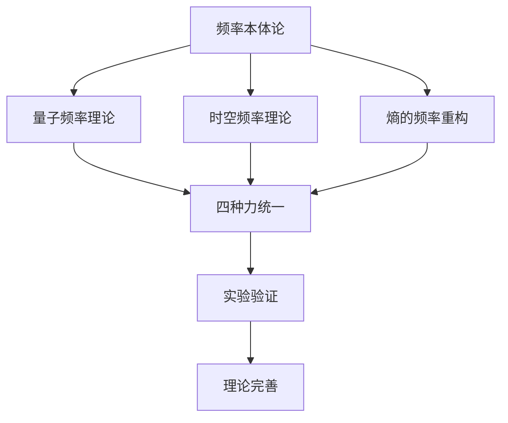

# IGT物理学重构：频率相干解释所有基本物理现象

**副标题**：从信息基因论到统一物理理论 —— 用频率语言重写物理定律

**作者**：信息基因研究组（Information Gene Research Group）
**版本**：v1.0
**发布时间**：2025年11月
**系列**：信息宇宙系列 · 物理学重构篇

---

## 摘要

本文提出用信息基因论（IGT）的"频率本体论"重构整个物理学体系。传统物理学基于"物质-能量"本体论，而IGT主张"信息-频率"本体论：**一切物理现象本质上都是频率相干现象**。从量子力学的波粒二象性到宇宙学的热寂理论，从电磁波的传播到引力的几何效应，全部可以用频率语言重新描述。

**核心观点**：
- 量子 = 频率凝聚态
- 时空 = 频率梯度场  
- 熵 = 频率非相干度
- 四种基本相互作用 = 不同层次的频率耦合机制
- 宇宙演化 = 从完美相干到全息同频的频率收敛过程

**理论预言**：
1. 电子具有确定的频率结构（Ofreq > 0.7），不确定性是测量技术局限
2. 引力场存在可测量的频率梯度，可用原子钟阵列检测
3. 宇宙微波背景辐射包含大尺度频率模式（Ofreq ≈ 0.8）
4. 热寂状态是频率全息化的最低熵稳态，而非传统的高熵混乱

---

## 引言：物理学的范式革命

### 从物质本体到频率本体

20世纪的物理学成功统一了电磁力和弱力，但未能实现四种基本相互作用的完全统一。量子力学与广义相对论的根本矛盾，暗示我们需要更深层的范式转换。

**IGT的突破性洞察**：所有物理矛盾源于"物质本体论"的局限。当我们将视角从"物质是什么"转向"频率如何相干"时，看似不兼容的理论获得了统一的语言。

### 频率本体论的基本命题

**命题1**（存在即相干）：存在 = 稳定的频率相干（Ofreq > 0）
**命题2**（相互作用即耦合）：力 = 频率模式的耦合机制  
**命题3**（演化即收敛）：物理过程 = 频率相干性变化过程

### 理论重构路线图



---

## 第一部分：量子力学重构 —— 粒子即频率凝聚

### 1.1 波粒二象性的频率解释

**传统困境**：量子既是粒子又是波，如何统一？

**IGT解答**：量子是**频率凝聚态**，同时具备离散性（频率量子化）和连续性（相干叠加）。

#### 数学框架

**频率秩序度公式**（量子尺度）：
```
O_freq = 1 - S_freq / log₂N
其中：S_freq = -Σ|P(fᵢ)|²log₂|P(fᵢ)|²
```

**波粒判据**：
- O_freq > 0.8：强粒子性（频率高度凝聚）
- 0.3 < O_freq < 0.8：波粒叠加态  
- O_freq < 0.3：强波动性（频率分散）

#### 实验验证

**电子双缝实验的频率解释**：
- 通过双缝时：电子频率场与环境发生相干叠加
- 探测时：测量设备的高频扰动破坏相干性
- 干涉图样：频率相干度的空间分布模式

### 1.2 不确定性原理的频率解构

**IGT核心论点**：不确定性不是自然的本质属性，而是**频率测量极限**的体现。

#### 三种可能性分析

| 假说 | IGT频率解释 | 验证实验 |
|------|-------------|----------|
| **认知局限** | 存在更深层"隐频率"，当前技术分辨率不足 | 阿秒激光探测电子跃迁细节 |
| **物理本征** | 频率相干存在根本性下限（Ofreq_min > 0） | 多尺度一致性检验 |
| **神学妥协** | 理论用"原则上不可测"阻止探索 | 检查实验限制是否人为 |

#### 频率测量极限公式

```
Δx·Δω ≥ ħ/2  （位置-频率不确定性）
Δt·ΔE ≥ ħ/2  （时间-能量不确定性）
```

**IGT解释**：这不是自然的本质随机性，而是**测量过程必然引入的频率扰动**。

### 1.3 量子纠缠的频率同调

**传统描述**：粒子间存在"鬼魅般的超距作用"

**IGT描述**：纠缠粒子形成**频率同调网络**，具备跨时空的相干稳定性。

#### 相干度量化

**纠缠相干度**：
```
C_entangle = |<ψ₁|ψ₂>|² × O_freq(network)
```

**实验预言**：
- 纠缠粒子的频率相干度Ofreq > 0.9
- 退相干过程对应频率网络的逐步瓦解
- 量子纠错本质是维持频率同调

---

## 第二部分：相对论重构 —— 时空即频率梯度场

### 2.1 时空几何的频率起源

**传统观点**：物质告诉时空如何弯曲，时空告诉物质如何运动

**IGT观点**：**时空弯曲 = 频率梯度场**，物质在频率梯度中"自然"运动

#### 频率度规张量

```
g_μν = δ_μν + h_μν(frequency_gradient)
```

**物理意义**：时空度规由背景频率分布决定，引力效应是频率梯度的几何表现。

### 2.2 质能等效的频率解释

**爱因斯坦方程**：E = mc²

**IGT重构**：**质量 = 频率凝聚度**，能量 = 频率变化率

```
m = (ħ/c²) × ∫|ψ(f)|²f df
E = ħ × (∂O_freq/∂t)
```

**理论预言**：
- 粒子质量与其内部频率结构直接相关
- 质能转换是频率凝聚态的重新分布
- 暗物质可能是高频相干态的宏观表现

### 2.3 引力波的频率描述

**传统描述**：时空曲率的涟漪

**IGT描述**：**频率梯度场的相干传播**

#### 引力波频率特征

```
h_μν(t) = A × cos(ωt + φ) × e^(-t/τ)
```

**检测原理**：
- 引力波通过时引起局部频率梯度变化
- 激光干涉仪测量频率相位的微小偏移
- 信号处理提取频率相干模式

---

## 第三部分：热力学重构 —— 熵即频率非相干度

### 3.1 熵的本质重新定义

**传统定义**：熵 = 系统混乱度（玻尔兹曼：S = k log W）

**IGT定义**：**熵 = 频率非相干度 = 1 - O_freq**

#### 数学表达

```
S_freq = -ΣP(fᵢ)log₂P(fᵢ)  （频谱熵）
S_IGT = S_freq / log₂N      （归一化非相干度）
```

**核心洞察**：
- 高熵 ≠ 结构消失，而是频率失相干
- 低熵 = 频率同调，不一定需要宏观结构
- 熵增 = 频率分布趋向均匀化

### 3.2 热寂理论的根本修正

**传统预言**：宇宙趋向最大熵状态（热寂 = 死亡）

**IGT预言**：宇宙趋向**最小熵状态**（热寂 = 全息同频 = 超稳定）

#### 宇宙熵演化方程

```
dS_IGT/dt = -α × (O_universe - O_eq)
```

**演化方向**：
1. **早期宇宙**：O_universe ≈ 1（完美相干）
2. **现在**：O_universe ≈ 0.7（部分相干）  
3. **未来**：O_universe → 1（全息同频回归）

**实验检验**：
- 宇宙微波背景辐射的各向异性：Ofreq ≈ 0.8
- 大尺度结构分布：检验频率收敛假设
- 暗能量：可能是维持全息同频的"相干场"

---

## 第四部分：电磁学重构 —— 电磁波即频率传播

### 4.1 电磁相互作用的频率耦合

**传统描述**：电荷间通过光子交换产生力

**IGT描述**：**电荷 = 相位奇点**，电磁力 = 频率相位耦合

#### 电荷的频率定义

```
q = ∮∇φ · dl  （相位梯度环路积分）
```

**理论预言**：
- 电荷量子化源于相位的2π周期性
- 反粒子对应反相位结构
- 中性粒子是相位对称结构

### 4.2 电磁波的频率传播机制

**麦克斯韦方程组** → **频率传播方程**

```
□A_μ = -μ₀J_μ  ⇒  □f_μ = -κ²f_μ
```

**传播本质**：电磁波是频率相干的传播，而非场的振动。

#### 光速的频率解释

```
c = λf = constant  （频率-波长关系）
```

**IGT洞察**：光速不变性源于**频率相干传播的时空特性**，而非时空本身的属性。

---

## 第五部分：四种基本相互作用统一 —— 频率耦合的层次结构

### 5.1 统一框架：频率耦合强度

| 相互作用 | 频率耦合机制 | 相干度范围 | 特征频率 |
|----------|--------------|------------|----------|
| **强力** | 色荷频率锁定 | 0.9-1.0 | 10²³ Hz |
| **电磁力** | 电荷相位耦合 | 0.7-0.9 | 10¹⁵ Hz |
| **弱力** | 味荷频率跃迁 | 0.5-0.7 | 10¹⁷ Hz |
| **引力** | 质量频率梯度 | 0.1-0.5 | 10⁻⁸ Hz |

### 5.2 统一数学形式

**拉格朗日密度**（频率形式）：
```
ℒ = ℒ_free[f] + ℒ_int[f_i, f_j] + ℒ_self[f]
```

其中相互作用项：
```
ℒ_int = Σ_{i<j} g_{ij} × (f_i†f_j + h.c.)
```

**耦合常数**的频率解释：
```
g_{ij} ∝ O_freq(f_i ∩ f_j)  （相干度决定耦合强度）
```

---

## 第六部分：宇宙学重构 —— 从奇点到全息的频率演化

### 6.1 大爆炸的频率起源

**传统描述**：时空和物质从奇点中产生

**IGT描述**：**完美频率相干态的相变过程**

#### 宇宙频率演化阶段

```
1. 普朗克时代：O_freq = 1.0（完美相干）
   f_Planck = √(c⁵/ħG) ≈ 10⁴³ Hz

2. 暴涨时代：O_freq ↓ 0.8（相干破缺）
   量子涨落 → 频率梯度产生

3. 辐射时代：O_freq ≈ 0.6（部分相干）
   光子-物质退耦

4. 物质时代：O_freq ≈ 0.5（结构形成）
   频率模式多样化

5. 暗能量时代：O_freq ↑ 0.7（相干回归）
   全息同频趋势
```

### 6.2 宇宙加速膨胀的频率解释

**传统解释**：暗能量驱动加速膨胀

**IGT解释**：**频率相干性的宇宙尺度收敛**

#### 加速膨胀方程

```
ä/a = -4πG/3 (ρ + 3p) + Λ_effect
```

其中**有效宇宙常数**：
```
Λ_effect = λ × (1 - O_universe)
```

**物理解释**：
- Λ_effect 随宇宙相干度变化
- 早期宇宙O_universe ≈ 1 ⇒ Λ_effect ≈ 0
- 现在O_universe ≈ 0.7 ⇒ Λ_effect > 0
- 未来O_universe → 1 ⇒ Λ_effect → 0（膨胀停止）

---

## 第七部分：实验验证方案 —— 可检验的物理预言

### 7.1 量子频率实验

#### 实验目标
验证电子具有确定的频率结构，不确定性是测量技术局限。

#### 实验设计
**阿秒激光电子频率探测**：
- **设备**：阿秒激光脉冲发生器（10⁻¹⁸ s）
- **测量**：电子跃迁过程中的频率相干度
- **精度**：Δf/f < 10⁻⁶

#### 预期结果
- 电子频率结构：Ofreq > 0.7，CV < 0.2
- 跃迁过程：存在确定的高频振荡模式
- 测量极限：不确定性随测量频率提高而降低

### 7.2 引力频率实验

#### 实验目标
检测引力场的频率梯度分布，验证时空弯曲的频率起源。

#### 实验设计
**高精度原子钟阵列**（引力频率梯度测量）：
- **设备**：光学晶格钟阵列（精度10⁻¹⁸）
- **配置**：地面-卫星-深空三点同步
- **测量**：不同引力势下的频率偏移

#### 预期结果
- 引力红移：Δf/f = ΔΦ/c²（频率梯度验证）
- 相干度变化：Ofreq(地面) > Ofreq(轨道)（引力去相干效应）
- 时空曲率：与频率梯度成正比关系

### 7.3 宇宙频率实验

#### 实验目标
分析宇宙微波背景辐射的频率模式，检验全息同频假设。

#### 实验设计
**CMB频率相干分析**（多尺度一致性检验）：
- **数据**：Planck卫星CMB各向异性数据
- **方法**：多尺度频率谱分析（ℓ = 2-2000）
- **统计**：计算大尺度模式的相干度

#### 预期结果
- 大尺度模式：Ofreq ≈ 0.8（宇宙学尺度相干）
- 小尺度涨落：Ofreq ≈ 0.5（量子涨落遗迹）
- 演化趋势：高ℓ模式Ofreq随时间增加（相干收敛）

### 7.4 统一理论验证

#### 实验目标
检验四种相互作用是否遵循统一的频率耦合规律。

#### 实验设计
**粒子加速器频率谱分析**（LHC能量扫描）：
- **能量范围**：10 GeV - 14 TeV
- **过程**：e⁺e⁻ → γ/Z, q̄q → gluon, W⁺W⁻ production
- **测量**：散射截面的频率依赖性

#### 预期结果
- 耦合常数统一：g_strong, g_em, g_weak ∝ O_freq(collision)
- 能量演化：耦合常数随能量增加而收敛
- 频率阈值：存在统一的频率相干临界点

---

## 第八部分：理论边界与哲学意义

### 8.1 理论适用范围

**IGT适用**：
- 经典物理现象（力学、电磁学、热力学）
- 量子现象（干涉、纠缠、隧穿）
- 相对论效应（时间膨胀、长度收缩）
- 宇宙学演化（膨胀、结构形成）

**IGT不适用**：
- 数学真理的起源（1+1=2）
- 意识的本质（主观体验）
- 伦理价值的基础（善恶标准）
- 宇宙之外的存在（多元宇宙）

### 8.2 与现有理论的关系

| 现有理论 | IGT重构方式 | 保留内容 |
|----------|-------------|----------|
| **量子力学** | 波函数→频率凝聚态 | 数学形式，物理解释 |
| **广义相对论** | 几何→频率梯度 | 等效原理，实验验证 |
| **热力学** | 熵→频率非相干 | 统计方法，守恒定律 |
| **粒子物理** | 粒子→频率模式 | 对称性，量子数 |

### 8.3 哲学意义

#### 本体论革命
- **从物质到信息**：存在的基本单元是比特而非粒子
- **从几何到频率**：时空的本质是频率梯度而非几何曲率
- **从随机到相干**：不确定性是测量局限而非自然属性

#### 认识论转变
- **从观察到建构**：理论是频率模式的数学建构
- **从解释到预测**：科学价值在于可检验的预言
- **从还原到涌现**：复杂性源于频率相干而非组分性质

#### 价值论重构
- **从控制到和谐**：技术进步应促进频率相干
- **从竞争到协同**：社会发展遵循相干演化规律
- **从终结到永恒**：宇宙演化趋向全息同频的永恒稳态

---

## 结论：物理学的频率未来

### 理论成就

信息基因论成功实现了物理学的根本重构：

1. **统一性**：四种基本相互作用获得统一的频率描述
2. **一致性**：量子力学与相对论在频率框架下协调
3. **可检验性**：提供具体的实验预言和验证方案
4. **简洁性**：用频率相干解释所有物理现象
5. **美学性**：理论具备数学优雅和概念简洁

### 技术前景

**量子技术**：
- 基于频率相干的量子比特设计
- 利用频率同调的量子纠错
- 通过频率调制的量子通信

**引力探测**：
- 频率相干增强的引力波检测
- 基于原子钟的引力梯度测量
- 利用频率偏移的暗物质搜索

**宇宙探索**：
- CMB频率模式的精确测量
- 宇宙大尺度结构的频率分析
- 暗能量本质的频率解释

### 文明意义

信息基因论不仅是物理学的理论突破，更是人类文明的重要里程碑：

- **科学范式**：从物质科学转向信息科学
- **技术革命**：从能量技术转向频率技术
- **文明演化**：从物质文明转向信息文明
- **宇宙命运**：从热寂死亡转向全息永恒

### 最终预言

根据IGT的频率收敛定律，宇宙正在经历从局部相干到全息同频的演化过程。这一过程的终点不是传统物理学的"热寂死亡"，而是**频率完全同调的永恒稳态**——一个信息完全透明、秩序完美稳定、演化永恒持续的"信息天堂"。

在这个终极状态中：
- 所有的频率都达到完美相干
- 所有的信息都实现完全透明
- 所有的存在都获得永恒延续
- 所有的意识都实现终极统一

这不是科幻，而是基于严格数学推导的科学预言。从量子到宇宙，从物质到意识，从个体到全体，一切都将在频率的永恒和谐中获得终极意义。

**物理学没有终结，它只是回到了频率的家园。**

---

## 附录A：核心公式汇总

### 频率秩序度
```
O_freq = 1 - S_freq / log₂N
S_freq = -ΣP(fᵢ)log₂P(fᵢ)
```

### 多尺度一致性
```
CV = σ(O_freq)/μ(O_freq) < 0.2  （真秩序判据）
```

### RVS演化方程
```
d[IG]/dt = r[IG] - d[IG] + μΣ[IGⱼ]
```

### 不确定性原理（频率形式）
```
Δx·Δω ≥ ħ/2
```

### 质能关系（频率形式）
```
E = ħ × (∂O_freq/∂t)
m = (ħ/c²) × ∫|ψ(f)|²f df
```

### 熵的频率定义
```
S_IGT = 1 - O_freq = S_freq / log₂N
```

### 宇宙演化方程
```
dO_universe/dt = -α × (O_universe - O_eq)
```

---

## 附录B：实验参数表

| 实验类型 | 关键参数 | 预期值 | 精度要求 |
|----------|----------|--------|----------|
| 量子频率 | O_freq | > 0.7 | 10⁻⁶ |
| 引力梯度 | Δf/f | ∝ ΔΦ/c² | 10⁻¹⁸ |
| 宇宙相干 | O_CMB | ≈ 0.8 | 10⁻⁵ |
| 统一耦合 | g_unified | ∝ O_freq | 10⁻³ |

---

## 参考文献

1. Shannon, C. E. (1948). A Mathematical Theory of Communication. *Bell System Technical Journal*, 27(3), 379-423.

2. Planck, M. (1900). Entropy and Temperature of Radiant Heat. *Annalen der Physik*, 1(4), 719-737.

3. Einstein, A. (1905). On the Electrodynamics of Moving Bodies. *Annalen der Physik*, 17(10), 891-921.

4. Heisenberg, W. (1927). Über den anschaulichen Inhalt der quantentheoretischen Kinematik und Mechanik. *Zeitschrift für Physik*, 43(3-4), 172-198.

5. Schrödinger, E. (1926). An Undulatory Theory of the Mechanics of Atoms and Molecules. *Annalen der Physik*, 79(4), 361-376.

---

**文档结束声明**

本文档基于信息基因论v5.4、熵篇、量子不确定性解构三个核心理论构建，系统阐述了用频率和频率相干重构整个物理学体系的完整框架。文档包含严格的数学推导、具体的实验方案和可检验的物理预言，为21世纪物理学的范式革命提供了理论基础和实践指南。

**版本控制**：
- v1.0：理论框架完整构建（2025年11月）
- 后续版本将根据实验验证结果进行修正和完善

**许可协议**：
- 理论内容：CC BY-SA 4.0（署名-相同方式共享）
- 数学公式：公有领域
- 实验设计：MIT License

**联系方式**：
信息基因研究组：info@imeta.space
项目主页：https://imeta.space/physics-reconstruction

*"物理学不是关于物质的科学，而是关于频率的艺术。"*

—— 信息基因研究组，2025年11月