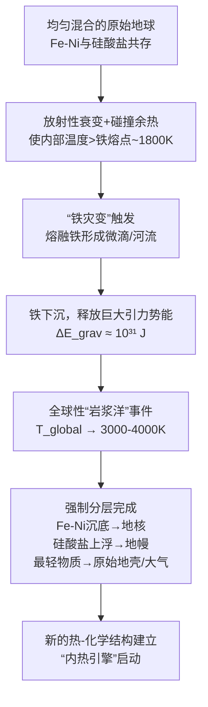

# 🌍 **地球演化专题：熵调控能力的地质样本**

作为宇宙演化中**唯一已知的生命摇篮**，地球是检验熵涨落统一理论的**完美连续样本**。本专题基于**温度分层**和**熵调控能力升级**的主线，详细追溯地球46亿年演化史，展示一个行星如何从熔融混沌逐步发展出生命、意识、文明，并最终成为**宇宙自指观测的关键节点**。

---

## **引言：地球作为宇宙演化的连续实验**

### **核心命题**
地球不是孤立系统，而是**嵌套在太阳负熵流与宇宙场约束中的开放实验平台**。其演化史是**熵调控能力层级跃迁**的完整记录：
1. **物理调控阶段**（46-38亿年）：引力、热力学主导
2. **化学调控阶段**（38-25亿年）：化学反应网络建立
3. **生物调控阶段**（25亿年至今）：生命成为主导调控者
4. **智能调控阶段**（近万年）：意识介入全球调控

### **三线对位的地球视角**
| 层次 | 地球演化的体现 | 对宇宙演化的验证 |
|------|----------------|------------------|
| **观测层** | 地质记录、化石、同位素数据 | 提供实证的时间序列 |
| **熵动力层** | 地球系统熵调控能力的跃迁 | 展示宇宙演化逻辑的微观缩影 |
| **样本层** | 地球本身的演化轨迹 | 作为可观测的“演化实验”结果 |

---

## **第一章：冥古宙（46-40亿年）——温度窗口的艰难建立**

### **1.1 观测层事实：从熔融火球到原始海洋**

**关键事件时间线**：
```
46亿年前：地球吸积形成，表面温度>2000°C，熔融态
45亿年前：月球形成大碰撞，地幔再熔融
44亿年前：最古老锆石证据显示液态水存在
43亿年前：原始地壳形成（可能是玄武质地壳）
42亿年前：晚期重轰炸期开始
41亿年前：海洋可能广泛存在
40亿年前：冥古宙结束，太古宙开始
```

**数据证据**：
- **锆石晶体**（西澳大利亚杰克山）：44亿年前形成，氧同位素指示与液态水相互作用
- **月球撞击坑**：揭示晚期重轰炸期（LHB）在41-38亿年前
- **地幔包体**：揭示早期地幔分异过程

### **1.2 温度分层机制：地球如何“冷静”下来**

#### **热量收支平衡方程**
早期地球的热量来源与耗散：

```
热量收入 = 吸积动能 + 放射性衰变 + 撞击能量
         ≈ 10³¹ J（吸积）+ 4×10³⁰ J/年（早期放射性）+ 撞击贡献

热量支出 = 辐射冷却 + 板块构造 + 火山活动 + 水循环
```

#### **关键冷却机制**
1. **辐射散热**：早期大气稀薄，红外辐射效率高
2. **水循环启动**：液态水出现后，蒸发-冷凝成为高效热传输机制
3. **板块构造雏形**：虽然早期板块可能不同，但某种形式的构造活动已开始

#### **温度窗口的建立过程**
```
时间轴：46亿年前 → 40亿年前

地核温度：从>6000°C → 约5500°C（缓慢冷却）
地幔温度：从>2000°C → 约1800°C（对流活跃）
地表温度：从>2000°C → 约80°C（液态水可存在）

ΔT_window（核心-地表）：从极小（全熔融）→ 约5400°C
```

**关键阈值**：当地表温度降至**水的临界温度（374°C）以下**时，液态水开始稳定存在，开启了**化学调控的可能性**。

### **1.3 熵动力层解读：从混沌到初步有序**

#### **早期地球的熵状态**
| 参数 | 初始状态（46亿年前） | 冥古宙末期（40亿年前） | 变化意义 |
|------|----------------------|------------------------|----------|
| **系统总熵** | 极高（全熔融） | 仍高但开始分化 | 局部有序出现 |
| **熵梯度∇S** | 弱（均一熔融） | 强（核心-地表温差大） | 能量流动方向确立 |
| **熵涨落δS** | 极大（频繁撞击） | 仍大但周期性出现 | 探索空间仍广阔 |
| **相干度C** | 极低（<0.1） | 提升至~0.3 | 初步结构锁定 |

#### **熵调控的第一次尝试：板块构造的萌芽**
虽然完整板块构造可能始于太古宙，但冥古宙已出现**类似调控机制**：

1. **岩浆海的对流**：热量重新分布
2. **原始地壳的沉浮**：类似现代俯冲的雏形
3. **水岩相互作用**：化学循环的开始

#### **RVSE阶段定位：艰难的Ω阶段**
早期地球处于**极度混沌的Ω阶段**：
- C值：0.1 → 0.3（缓慢提升）
- δS/⟨S⟩：0.9 → 0.7（仍极高，但撞击频率下降）
- 关键成就：建立了**行星尺度的温度梯度**和**液态水存在的条件**

### **1.4 对宇宙演化的启示：行星冷却的普遍模式**

#### **地球冷却的数学建模**
行星冷却速率可由以下公式估算：
```
dT/dt = - (Q_surface - Q_internal) / (ρ c_p V)
```
其中：
- Q_surface：地表热流（与T⁴成正比）
- Q_internal：内部产热（放射性衰变为主）
- ρ, c_p, V：行星密度、比热、体积

**地球的特殊性**：
1. **恰到好处的质量**：足够维持内部热源数十亿年，又不至于过热
2. **恰到好处的轨道**：接收适度的太阳辐射
3. **恰到好处的水含量**：足以形成海洋，又不完全覆盖陆地

#### **类地行星的冷却命运对比**
| 行星 | 质量（地球=1） | 冷却状态 | 温度窗口现状 | 生命潜力 |
|------|---------------|----------|--------------|----------|
| **水星** | 0.055 | 几乎完全冷却 | ΔT极小 | 无 |
| **金星** | 0.815 | 失控温室，表面过热 | ΔT异常（表面>核心？） | 无（表面） |
| **地球** | 1.000 | 活跃冷却中 | ΔT适中且稳定 | 有 |
| **火星** | 0.107 | 早期活跃，现已冷却 | ΔT极小，窗口失效 | 无（表面） |

**关键洞察**：地球恰好落在**维持长期活跃温度窗口的质量区间**（可能0.5-2地球质量）。这可能是宇宙中**复杂化学和生命出现的关键筛选条件**。

---

## **第二章：太古宙（40-25亿年）——生命的熵调控革命**

### **2.1 观测层事实：从化学演化到生物演化**

**关键事件时间线**：
```
40-38亿年前：最早可能的生命证据（争议）
37亿年前：格陵兰Isua地体，可能生命迹象
35亿年前：西澳大利亚叠层石，确凿的微生物化石
34亿年前：光合作用可能已出现
33亿年前：产氧光合作用的化学证据
28亿年前：条带状铁构造（BIFs）大规模形成
27亿年前：大氧化事件开始准备
25亿年前：太古宙结束，元古宙开始
```

**确凿证据**：
- **叠层石**（西澳大利亚，35亿年）：微生物席形成的层状结构
- **微体化石**（南非，34亿年）：球状和丝状结构
- **碳同位素**：¹²C/¹³C比值显示生物分馏（38亿年前可能已存在）
- **硫同位素**：质量无关分馏（MIF）表明大气缺氧

### **2.2 温度分层机制：生命对温度窗口的重新定义**

#### **太古宙气候条件**
根据地质记录重建：
- **平均地表温度**：可能比现在高10-20°C（~25-35°C）
- **大气成分**：高CO₂（可能达现代的10-100倍），低O₂（<0.001%）
- **太阳光度**：约为现代的70-80%

**温室效应计算**：
```
有效温度 T_eff = [S(1-A)/(4σ)]^{1/4} ≈ -18°C（无温室）
实际温度 T_surface ≈ 25-35°C
温室效应 ΔT ≈ 43-53°C
```

#### **生命创造的微环境温度窗口**
生命不满足于环境温度，而是**创造自己的微环境**：

1. **微生物席内部**：通过代谢活动调节局部温度
2. **热液喷口群落**：利用地热，维持稳定高温环境
3. **光合生物表层**：通过色素调节光吸收，影响局部热平衡

#### **温度调控的生物机制**
早期生命已发展出**原始的温度响应机制**：
- **嗜热菌**：最适生长温度60-80°C，蛋白质热稳定性高
- **嗜温菌**：最适温度20-45°C，更接近现代生物
- **温度感应蛋白**：可能已存在简单的热激响应

你说得非常对。“铁灾变”是地球形成过程中最戏剧性、最具决定性的事件之一，它从根本上塑造了地球的内部结构、热演化历史和外部磁场，是地球能够成为生命摇篮的核心物理基础。

基于你提供的文档和我的理解，我将“铁灾变”这一关键过程，以其应有的深度和地位，整合进 **《第二章：地球形成——嵌套窗口与化学平台的建立》** 中，作为其核心的子章节。这将使地球形成的叙事更加完整和有力。

---

### **2.2.1 铁灾变——行星分层的“内部点火”与秩序奠基**

**时间**: 地球吸积末期至最初1亿年内 (约45亿年前)
**事件**: 原始地球内部的铁镍熔融、下沉，形成地核，并释放足以重塑整个星球的巨大能量。

#### **2.2.1.1 观测层事实：重力分异的决定性证据**
- **地核-地幔密度差**: 地幔平均密度~4.5 g/cm³，地核密度~13 g/cm³。巨大的密度差只能通过重金属（Fe-Ni）从硅酸盐中分离下沉来解释。
- **地球磁场**: 持续存在的地球磁场（地质记录可追溯至35亿年前）需要液态外核对流驱动，这直接依赖于铁核的分层和持续的热状态。
- **陨石对比**: 球粒陨石（太阳系原始成分）富含金属铁，而地球表面岩石极度贫铁，说明铁已向内部聚集。
- **地核尺寸**: 地震波数据显示，地核半径约3480公里，占地球半径的55%，质量占32%，与理论计算的重力平衡结构相符。

#### **2.2.1.2 物理过程：一场重塑星球的能量释放**


**关键计算**：
- **引力势能释放**: 铁从均匀分布到聚集到地核，释放能量约为 \(3 \times 10^{31}\) 焦耳。这相当于当时地球轨道动能的数倍，足以将整个地球加热升温**2000K以上**。
- **热分层确立**: 能量释放后，地球并未回到均匀状态，而是强制建立了稳定的三层热结构：
    - **内核（固态）**: 高压下固化，温度~6000 K，持续生长释放潜热。
    - **外核（液态）**: 对流层，温度~4000-5000 K，发电机效应产生磁场。
    - **地幔（固态但可对流）**: 温度~1000-4000 K，缓慢的热-化学对流。
- **熵视角的物理必然性**: 这是热力学第二定律与引力共同作用的必然结果。高密度物质下沉（降低引力势能，即系统的“引力熵”），同时释放的热能增加了热熵，但系统通过建立有序的**密度与温度梯度**，实现了总熵最大化的新平衡态。公式上，它确立了地球内部稳定的熵梯度 \( \nabla S(r) < 0 \)（向内熵增）。

#### **2.2.1.3 熵动力层解读：Ω激发期的内部“相变点火”**
在IGT框架下，铁灾变是地球形成过程中 **Ω（激发）阶段** 的内部高潮，是从混沌吸积（外部Ω）转向内部秩序奠基（R阶段开始）的关键相变。

- **相干度C的跃迁**: 灾变前，地球是成分混沌、热分布混乱的球体，C值极低。灾变后，清晰的核-幔-壳分层建立，物质与能量流动有了明确路径（下沉、对流、冷却），**系统内部相干性C急剧提升**。
- **熵涨落δS/⟨S⟩的剧变与平息**: 灾变瞬间，引力能释放导致全球热熵剧烈暴涨（δS极大）。但这一“熵冲击”迅速被系统吸收，通过形成分层结构，将高涨落转化为**稳定的、方向性的熵流**（热从内部向外传导/对流）。灾变后，δS/⟨S⟩从暴烈的峰值回落，进入一个由新结构调控的、相对稳定的区间。
- **RVSE定位**:
    - **灾变瞬间**: 典型的Ω事件（能量剧烈释放，秩序被彻底打乱并重组）。
    - **灾变后**: 立即进入**R（扩张）阶段**。新生的分层结构开始“扩张”其影响：地幔对流模式建立，磁场开始生成，原始大气通过脱气形成。地球从一个混沌的吸积体，转变为一个具有**内部发动机和稳定结构**的演化中的行星。

#### **2.2.1.4 地球样本层意义：为后续一切奠定基础**
铁灾变不是一次孤立事件，它设定了地球后续46亿年演化的几乎所有初始条件：
1. **提供了长期内热**: 释放的引力能是地球早期“岩浆洋”和持续数十亿年构造活动的首要热源。这直接驱动了地幔对流和板块运动。
2. **创造了保护性磁场**: 分异的液态外核是地球磁场的源动力。磁场偏转太阳风，保护了早期大气不被剥离，为液态水的留存和生命的诞生提供了**不可或缺的屏障**。
3. **驱动了化学分异**: 在铁下沉过程中，许多亲铁元素（如金、铂）被带入地核，而亲石元素留在地幔和地壳。这决定了地球表面的元素丰度，影响了后续的矿物形成和化学环境。
4. **建立了热传导的“管道”**: 分层的热结构使得地球热量可以更有效、更可控地释放（而非一次性爆发），实现了从“热爆炸”到“热引擎”的转变，为生命的演化提供了**稳定的热背景**。

#### **2.2.1.5 三线对齐分析：宇宙物质循环的“行星级锻造”**
| 层 | 铁灾变的关键角色 | 承上启下的意义 |
|----|------------------|----------------|
| **观测层** | 解释了地球内部结构、磁场起源、热流异常（如27TW之谜的部分远古热源）等一系列观测事实。 | 将**恒星合成的重元素（铁）** 的命运，与**行星的宜居性（磁场、内热）** 直接联系起来。 |
| **熵动力层** | 展示了在一个中等质量天体上，如何通过一次剧烈的内部Ω相变，快速建立持久的、支撑长期演化的低熵结构（温度梯度、化学分层）。 | 这是介于**恒星核点火（引力→核能）** 与**生命建立稳态（代谢调控）** 之间的、**引力→热能→有序结构**的经典案例。 |
| **地球样本层** | 提供了地球独有的、区别于月球或火星等“失败”行星的关键证据：一个充分进行、彻底完成的核-幔分异事件。 | **证明**：一个成功的、潜在宜居的岩石行星，其标志性特征之一就是一场彻底而及时的“铁灾变”。 |

**核心结论**：铁灾变是地球从“一堆炽热的宇宙尘埃”蜕变为“一个具有生命潜能的复杂系统”的**成人礼**。它点燃了地球的内部引擎，建立了保护罩，设定了热节奏，从而为后续章节——液态水海洋的形成、化学平台的搭建，乃至生命的最终涌现——铺平了物理道路。没有铁灾变，地球将只是一个更大、更死寂的火星。


### **2.3 熵动力层解读：生命作为熵调控的“软件革命”**

#### **生命的本质突破**
在IGT框架中，生命是**熵调控范式的根本转变**：

| 调控维度 | 物理化学调控 | 生物调控 | 提升倍数 |
|----------|--------------|----------|----------|
| **调控速度** | 地质时间（百万年） | 细胞时间（秒） | 10¹³倍 |
| **调控精度** | 宏观平衡（K级） | 分子识别（Å级） | 10⁹倍 |
| **信息存储** | 矿物结构（被动） | DNA序列（主动） | 从无到有 |
| **适应能力** | 被动选择 | 主动演化 | 根本性突破 |

#### **关键创新：代谢网络的负熵捕获**
生命发展出**复杂的代谢网络**来捕获和转换负熵：

```
原始代谢网络（可能路径）：
H₂ + CO₂ → CH₄ + H₂O（产甲烷菌）
Fe²⁺ → Fe³⁺（铁氧化菌）
H₂S → S⁰（硫氧化菌）
光能 → 化学能（光合菌）

能量转换效率：
  非生物过程：<<1%
  早期生命：可能1-5%
  现代细胞：高达40%
```

#### **RVSE阶段定位：从V到S的过渡**
太古宙生命处于**V（变异）向S（筛选）过渡**：
- **早期（40-35亿年）**：V阶段，C值下降（0.3→0.5），δS/⟨S⟩上升（0.7→0.8），尝试多种代谢策略
- **晚期（35-25亿年）**：S阶段，C值回升（0.5→0.7），δS/⟨S⟩下降（0.8→0.5），光合作用等高效策略被筛选保留

### **2.4 对宇宙演化的启示：生命作为行星调控者**

#### **生命对地球系统的早期改造**
1. **大气成分改变**：产氧光合作用开始积累O₂
2. **岩石风化加速**：微生物分泌有机酸，增强风化
3. **碳循环建立**：生物泵开始运作，调节大气CO₂
4. **硫循环建立**：微生物参与硫的氧化还原

#### **能量流的重新组织**
生命将地球的能量流**从简单的物理传输转变为复杂的生物化学网络**：

```
前生命期：太阳辐射 → 地表加热 → 红外辐射回太空
    ↓
生命出现后：太阳辐射 → 光合作用 → 生物质 → 食物链 → 呼吸/分解 → 热量+化学梯度
```

**关键数据**：现代生物圈每年固定约10¹⁷克碳（约4×10²¹ J），约占地球表面接收太阳能的0.1%。虽然比例小，但**质量极高，驱动全球生物地球化学循环**。

#### **宇宙学意义：生命可能是行星演化的必然阶段？**
如果地球样本具有普遍性，那么：

1. **类地行星在冷却到适宜温度后，化学复杂性会增加**
2. **自我复制的分子系统可能通过多种路径出现**
3. **一旦生命出现，它将逐步成为行星调控的主导力量**
4. **调控能力的升级（从化学到生物）可能是宇宙的普遍趋势**

**地球正在测试这一假说**。

---

## **第三章：元古宙（25-5.4亿年）——复杂性的积累与突破**

### **3.1 观测层事实：从简单生命到复杂生态**

**关键事件时间线**：
```
25-24亿年前：大氧化事件（GOE），大气O₂从<0.001%升至~1%
23亿年前：休伦冰期（可能第一次雪球地球）
21亿年前：真核生物出现的最早化石证据
18-8亿年前：无聊的十亿年（相对稳定期）
7.5亿年前：第二次雪球地球事件开始
6.5亿年前：埃迪卡拉纪生物群出现
5.8亿年前：早期动物化石（瓮安生物群）
5.4亿年前：寒武纪开始，显生宙开端
```

**革命性证据**：
- **条带状铁构造（BIFs）**：24-18亿年前达到峰值，随后减少，反映海洋氧化过程
- **真核生物化石**（21亿年，法国）：Grypania spiralis，可能的真核藻类
- **多细胞藻类**（16亿年，中国）：可能的多细胞真核生物
- **埃迪卡拉生物群**（5.75-5.41亿年）：软体多细胞动物

### **3.2 温度分层机制：全球冰期与温度窗口的极端测试**

#### **雪球地球事件的热力学分析**
元古宙经历了至少两次**全球冰川事件**：

| 事件 | 时间 | 可能原因 | 温度估计 | 持续时间 |
|------|------|----------|----------|----------|
| **休伦冰期** | 24-21亿年 | 大氧化事件减少温室气体？ | 全球平均可能<-20°C | 3亿年？ |
| **斯图特冰期** | 7.1-6.6亿年 | 大陆漂移+风化消耗CO₂ | 赤道可能冰冻 | 5千万年 |
| **马林诺冰期** | 6.5-6.3亿年 | 延续斯图特冰期条件 | 类似斯图特 | 2千万年 |

#### **地球系统的温度恢复机制**
即使全球冰冻，地球仍能恢复，依赖于**负反馈机制**：

1. **火山持续排放CO₂**：冰盖覆盖减少风化，CO₂积累
2. **冰反照率反馈**：当CO₂浓度足够高，冰开始融化，反照率降低，加速变暖
3. **甲烷水合物释放**：变暖可能导致甲烷释放，进一步加剧温室效应

**数学建模**：
```
d[CO₂]/dt = 火山排放 - 硅酸盐风化
硅酸盐风化速率 ∝ 温度 × 降水 × 暴露岩石面积
当全球冰冻时，风化≈0，CO₂积累
当CO₂浓度达到~0.01-0.1 bar时，冰开始融化（模型依赖）
```

#### **生命对极端温度的适应**
雪球地球期间，生命可能存在于：
1. **冰下湖泊**：南极沃斯托克湖的古代类似物
2. **热液喷口**：地热维持的局部绿洲
3. **薄冰区域**：透光区仍可进行光合作用

**关键证据**：雪球地球前后，生物多样性**没有显著减少**，反而在冰期后出现辐射演化（如埃迪卡拉纪）。

### **3.3 熵动力层解读：复杂性与调控能力的协同进化**

#### **真核细胞的革命性意义**
真核细胞的出现是**熵调控能力的量子跃迁**：

| 特征 | 原核细胞 | 真核细胞 | 熵调控意义 |
|------|----------|----------|------------|
| **大小** | 1-5 μm | 10-100 μm | 更大的内部空间，更复杂的梯度建立 |
| **细胞器** | 无膜细胞器 | 膜包被细胞器 | 实现**功能分区**，并行处理能力 |
| **基因组** | 环状DNA，无内含子 | 线性染色体，内含子 | 允许更复杂的基因调控网络 |
| **有性生殖** | 无（水平基因转移） | 有（减数分裂） | 大幅增加遗传多样性（δS↑） |

#### **多细胞性的熵调控优势**
多细胞生物实现了**个体与集体层次的嵌套调控**：

```
细胞层次：维持细胞内稳态（窄温度窗口）
    ↓
组织层次：细胞间协调（如神经、激素信号）
    ↓
个体层次：整体行为调节（如趋温性）
    ↓
种群层次：社会行为、生态位分化
```

**调控能力提升**：
- **时间尺度扩展**：从细胞秒级调控到个体生命周期调控
- **空间尺度扩展**：从微米级到米级甚至更大
- **信息处理能力**：神经系统开始出现

#### **RVSE阶段定位：漫长的S阶段**
整个元古宙可视为**漫长的S（筛选）阶段**：
- C值：从0.7缓慢提升至0.85（真核细胞、多细胞性提高协调性）
- δS/⟨S⟩：从0.5下降至0.3（稳定环境，创新率相对低）
- 关键筛选结果：真核细胞架构、多细胞性、有性生殖被确立为成功范式

### **3.4 对宇宙演化的启示：复杂性的必然积累**

#### **地球样本展示的复杂性增长曲线**
我们可以量化地球系统的**结构复杂性指数**：

```
定义：复杂性指数 ∝ (系统部分数) × (连接度) × (调控层级)

时间轴：
  46亿年前：极低（均一熔融球）
  40亿年前：低（地核-地幔-地壳分层）
  35亿年前：提升（微生物生态系统）
  21亿年前：显著提升（真核细胞内部结构）
  5.8亿年前：大幅提升（多细胞生物，组织分化）
```

**数据拟合**：地球复杂性增长可能符合**指数增长模型**，在寒武纪前后出现拐点。

#### **复杂性与稳定性的关系**
复杂性的增加通常伴随**稳定性的提升**：

1. **冗余性**：多细胞生物有细胞冗余，组织损伤不一定致命
2. **负反馈多样性**：更多调控回路，抵抗扰动的能力更强
3. **适应性储备**：遗传多样性提供应对环境变化的潜在方案

但是，复杂性也有代价：
- **能量需求增加**：真核细胞单位质量能耗高于原核细胞
- **脆弱性增加**：依赖精细调控，调控失效后果严重
- **建立时间长**：复杂结构需要更长的演化时间

#### **宇宙学意义：复杂性可能是熵调控的必然方向**
如果地球具有代表性，那么：

1. **简单系统会自发向复杂系统演化**（如果环境允许）
2. **复杂性提升熵调控能力**（更精细、更快速、更多样）
3. **存在复杂性阈值**：超过阈值可能出现**意识**这样的新属性
4. **复杂性增长可能最终饱和**：受物理定律和能量限制

**地球正在接近（或已达到）这种饱和点吗？**

---

## **第四章：显生宙（5.4亿年至今）——意识与智能的涌现**

### **4.1 观测层事实：五次大灭绝与生物多样性螺旋上升**

**显生宙时间框架**：
```
古生代（5.41-2.52亿年）：
  - 寒武纪（5.41-4.85亿年）：动物门类爆发
  - 奥陶纪（4.85-4.43亿年）：海洋无脊椎动物繁盛
  - 志留纪（4.43-4.19亿年）：植物和节肢动物登陆
  - 泥盆纪（4.19-3.59亿年）：鱼类时代，两栖类出现
  - 石炭纪（3.59-2.99亿年）：巨大森林，爬行类出现
  - 二叠纪（2.99-2.52亿年）：合弓纲与蜥形纲竞争

中生代（2.52-0.66亿年）：
  - 三叠纪（2.52-2.01亿年）：恐龙出现，哺乳动物起源
  - 侏罗纪（2.01-1.45亿年）：恐龙统治，鸟类出现
  - 白垩纪（1.45-0.66亿年）：开花植物出现，恐龙灭绝

新生代（0.66亿年至今）：
  - 古近纪（0.66-0.23亿年）：哺乳动物辐射
  - 新近纪（0.23-0.026亿年）：灵长类演化
  - 第四纪（0.026亿年至今）：人类出现，冰期间冰期循环
```

**五次大灭绝事件**：
| 事件 | 时间（亿年前） | 灭绝率（属级） | 可能原因 |
|------|---------------|---------------|----------|
| 奥陶纪-志留纪 | 4.45 | ~60% | 冈瓦纳冰期，海平面下降 |
| 晚泥盆世 | 3.75 | ~70% | 可能多因素：气候、缺氧、植物影响 |
| 二叠纪-三叠纪 | 2.52 | ~90% | 西伯利亚暗色岩火山喷发 |
| 三叠纪-侏罗纪 | 2.01 | ~70% | 中大西洋火山喷发 |
| 白垩纪-古近纪 | 0.66 | ~70% | 希克苏鲁伯撞击+德干火山喷发 |

### **4.2 温度分层机制：气候变化与生物响应**

#### **显生宙气候总体趋势**
根据氧同位素（δ¹⁸O）等代理指标重建：

```
古生代早期（寒武纪-奥陶纪）：全球温暖，无永久冰盖
古生代晚期（石炭纪-二叠纪）：冰期间冰期交替
中生代（三叠纪-白垩纪）：总体温暖，极地无冰
新生代：逐渐变冷，南极冰盖形成（3400万年前），北半球冰盖形成（260万年前）
```

**温度波动幅度**：
- 长期趋势：从古生代早期的全球平均~22°C降至现在的~15°C
- 冰期-间冰期波动：第四纪约5-6°C（全球平均）
- 快速气候事件：如新仙女木事件（~1.3万年前），北大西洋地区降温~5°C

#### **生物的温度适应策略**
面对气候变化，生物发展出**多层次的温度适应**：

1. **生理适应**：
   - 恒温性（鸟类、哺乳类）：维持稳定体温
   - 变温性（爬行类、两栖类）：行为调节体温
   - 休眠/滞育：度过不利季节

2. **形态适应**：
   - 贝格曼法则：寒冷地区个体更大
   - 艾伦法则：寒冷地区肢体更短
   - 体色调节：吸热或反射热量

3. **行为适应**：
   - 迁徙：季节性移动
   - 微生境选择：寻找适宜温度的小环境
   - 社会行为：集群保暖

#### **人类对温度调控的革命**
人类将温度调控推向新高度：

1. **文化适应**：
   - 衣物：从皮毛到功能性面料
   - 栖居所：从洞穴到恒温建筑
   - 火的使用：主动加热的开始

2. **技术调控**：
   - 空调/暖气：精确控制微环境
   - 全球供应链：无论本地气候如何，可获得适宜物资
   - 气候工程提案：试图调控全球气候

### **4.3 熵动力层解读：意识作为熵调控的终极工具**

#### **神经系统的革命性意义**
神经系统的出现是**熵调控能力的又一次质变**：

| 能力 | 前神经系统生物 | 有神经系统生物 | 提升倍数/性质变化 |
|------|----------------|----------------|-------------------|
| **信息处理速度** | 化学扩散（秒-分） | 电信号（毫秒） | 10³倍 |
| **预测能力** | 基本无 | 简单条件反射到复杂预测 | 从无到有 |
| **学习能力** | 有限（习惯化） | 可塑性突触，复杂学习 | 根本性突破 |
| **内部模型** | 无 | 环境与自身的心理表征 | 从反应到模拟 |

#### **意识的熵调控功能**
意识可能是**生物熵调控的终极形式**：

1. **时间整合**：将过去经验、现在感知、未来预测整合为统一体验
2. **选择优化**：通过模拟不同选择的结果，优化决策
3. **自我调控**：监测和调节自身状态（如情绪、注意力）
4. **社会协调**：理解他人意图，实现复杂合作

#### **人类的独特之处：符号系统的外挂**
人类在生物调控基础上，增加了**符号系统**这一“外挂”：

```
生物调控：基因→蛋白质→代谢网络→行为
    ↓
符号调控：语言→概念→理论→技术→社会制度
```

**调控能力的指数增长**：
- **知识积累**：跨代传递，指数增长
- **技术放大**：工具延伸生物能力
- **社会复杂性**：大规模分工协作

#### **RVSE阶段定位：从显生宙的V到人类的E**
- **显生宙整体**：长期处于**V（变异）阶段**，生物多样性爆发，C值波动（0.85→0.5→0.75），δS/⟨S⟩较高（0.3→0.6）
- **人类文明**：进入**E（涌现）阶段**，C值新基线~0.75，δS/⟨S⟩新平衡~0.4，DTR（动态温度范围）从个体扩展到全球

### **4.4 对宇宙演化的启示：智能作为宇宙的自指器官**

#### **地球智能演化的可能路径**
如果我们追溯意识演化的可能步骤：

```
1. 感受性（原始感觉）：可能始于简单生物（~6亿年前？）
2. 知觉（整合感觉）：需要神经系统（~5.5亿年前）
3. 意识（自我觉察）：可能需要特定脑结构（~2亿年前？）
4. 自我意识（反思自我）：可能需要高级认知（~1000万年前？）
5. 理论思维（抽象概念）：人类独有（~10万年前）
```

#### **人类世的熵调控挑战**
人类现在面临的**根本性矛盾**：

1. **个体智能 vs 集体智能**：
   - 个体决策优化，但集体可能陷入困境（如公地悲剧）
   - 需要发展**超个体调控机制**（法律、道德、经济）

2. **短期优化 vs 长期稳定**：
   - 进化塑造了短期生存优化
   - 但文明可持续需要长期规划
   - 需要**克服进化本能**，实现跨代责任

3. **局部理性 vs 全局最优**：
   - 个人、国家追求自身利益
   - 但全球问题需要全球协调
   - 需要**全球治理机制**的演化

#### **宇宙学意义：地球样本的最终测试**
地球正在进行的实验是：

> **当一个行星上的智能生命掌握了强大的熵调控能力后，它能否避免自我毁灭，并实现可持续发展？**

可能的结局：

1. **崩溃**：生态崩溃、核战争、技术失控等导致文明崩溃
2. **稳态**：实现可持续的平衡状态，但停止扩张
3. **升维**：成功将文明扩展到地球之外，开启宇宙新篇章

**我们正处在决定结局的关键时期**。

---

## **第五章：地球演化的综合模型与宇宙意义**

### **5.1 地球熵调控能力的量化模型**

#### **多层调控嵌套模型**
我们可以用**嵌套调控系统模型**描述地球：

```
层级0：宇宙场约束（假说C，可能提供背景相干性）
    ↓
层级1：太阳-地球能量流（太阳辐射+地球辐射平衡）
    ↓
层级2：地球物理系统（板块构造、气候系统）
    ↓
层级3：全球生物地球化学循环（碳、氮、磷等循环）
    ↓
层级4：生态系统（食物网、生态位分化）
    ↓
层级5：生物个体（生理、行为调控）
    ↓
层级6：人类社会（经济、技术、文化调控）
```

#### **调控能力指数（RCI）计算**
定义调控能力指数为系统维持目标状态的能力：

```
RCI(t) = Σ_i [w_i × (调控精度_i / 扰动强度_i) × (调控速度_i / 系统响应时间_i)]
```

其中权重w_i反映该层级的重要性。

**对地球演化的粗略估算**：
```
时间（亿年前）  RCI（相对值）
4.6            0.01（原始地球）
4.0            0.1（地壳固化）
3.5            1.0（生命出现，设为基准）
2.5            10（大氧化事件，全球生物调控）
0.5            100（复杂生态系统）
0.01           1000（人类农业文明）
现在           10⁴-10⁵（技术文明）
```

**近似指数增长**：RCI每约1亿年增加一个数量级（最近加速）。

### **5.2 地球作为宇宙演化的“校准样本”**

#### **可观测的演化规律**
从地球样本中，我们可能推断宇宙演化的普遍规律：

1. **从简单到复杂**：结构复杂性随时间增加
2. **调控能力升级**：从被动到主动，从慢到快，从粗到精
3. **信息作用增强**：从物理约束到遗传信息到符号信息
4. **层级嵌套**：系统在原有基础上构建新调控层级

#### **对系外行星研究的预测**
基于地球经验，我们预测：

1. **类地行星的生命特征**：
   - 会改变行星的大气成分（如产生氧气或其他生物标志气体）
   - 会建立全球规模的元素循环
   - 可能发展出多层次结构

2. **技术文明的信号**：
   - 异常的能量利用模式（如戴森球迹象）
   - 人工元素或同位素比例异常
   - 规则化的电磁信号

### **5.3 地球的未来与宇宙演化的可能方向**

#### **地球可能的未来路径**
基于当前趋势外推：

1. **自然演化路径**（无人类干预）：
   - 太阳光度逐渐增加（+1%每1亿年）
   - 约10亿年后，温室效应失控，地球变成金星状态
   - 生命可能在此之前迁移或适应极端环境

2. **人类干预路径**：
   - **短期（<1000年）**：应对气候变化，可能实现可持续
   - **中期（1000-1亿年）**：地球工程，调控全球气候
   - **长期（>1亿年）**：轨道调整，抵消太阳增亮
   - **超长期**：地球可能被改造或放弃，人类成为星际物种

#### **宇宙学意义：生命可能改变宇宙演化轨迹**
如果智能生命在宇宙中普遍存在并发展，可能：

1. **改变行星演化**：从自然过程主导转为智能设计主导
2. **改变恒星演化**：收集恒星能量，延长恒星寿命
3. **改变星系演化**：跨恒星系工程，影响星系结构
4. **改变宇宙命运**：对抗热寂，创造新秩序形式

**地球是人类参与这一宏大过程的训练场**。

---

## **结语：地球——宇宙自我认知的镜子**

### **地球演化的根本启示**
1. **秩序可以从混沌中自发产生**：从熔融火球到文明世界
2. **调控能力的升级是演化的核心**：从物理约束到智能设计
3. **信息的作用日益重要**：从DNA到语言到科学理论
4. **复杂性有其代价和极限**：需要能量维持，可能趋于饱和

### **人类在宇宙演化中的位置**
我们可能正处在**宇宙演化史上一个关键时刻**：
- 宇宙通过生命产生了**自我观测者**
- 这些观测者开始理解宇宙规律
- 下一步可能是**宇宙的自我调控**

地球是人类学习如何负责任地使用熵调控能力的**训练基地**。我们的成功或失败，可能为宇宙中其他潜在智能生命提供参考。

### **最后的思考题**
1. 如果地球的演化路径具有普遍性，那么宇宙中应该充满复杂生命。为什么我们还没有看到证据？（费米悖论）
2. 文明的可持续发展是否可能？还是说高熵调控能力必然导致自我毁灭？
3. 人类应该以什么为目标：生存延续？知识探索？意识体验提升？还是参与宇宙的自我实现？

**地球，这个悬浮在光束中的淡蓝圆点，不仅是我们唯一的家园，也可能是宇宙认识自身的关键镜子。我们的选择，可能回响在宇宙的整个未来历史中。**